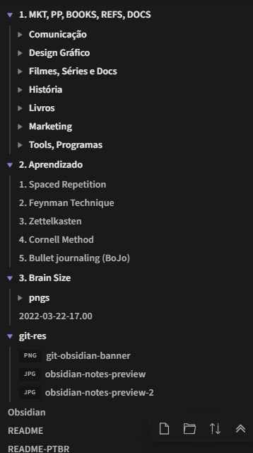

> [Read in English](/README.md)

# myObsidian
Anotações e rede de conhecimentos usando o programa [Obsidian](https://obsidian.md/)

## Sobre
Essa é uma coleção de todas as minhas notas relacionadas ao meu curso superior, e de outros áreas. Inclui vários tópicos da área de comunicação, gestão, design gráfico e tecnologias relacionadas; de tipografia à administração de negócios, cores à empreendedorismo, leis jurídicas à desenvolvimento web. Basicamente tudo relacionado à minha jornada profissional. A maior parte dos textos são escritos em Português, mas existem seções em Inglês.

**Atenção:** Vejas as notas apenas como curiosidade ou para rápidas referências, **não use-as** como base para os seus conhecimentos. É de crucial importância que você desenvolva a sua *prória* base de conhecimentos (ou como diz a equipe do Obsidian: *o seu segundo cérebro*). Esse é um ponto chave no seu processo de aprendizagem.

---

*em 22.03.22*

---

## Ver estas notas no Obsidian
- [Faça o download do repositório](https://github.com/fariaslucas-mkt/Obsidian/archive/refs/heads/main.zip)
- Extraia a pasta principal em qualquer lugar
- Baixe, instale e abra o [Obsidian](https://obsidian.md/)
- Na tela de início, selecione *abrir pasta como cofre/abrir pasta como vault*
- Selecione a pasta que foi extraída (*obsidian-main*)
